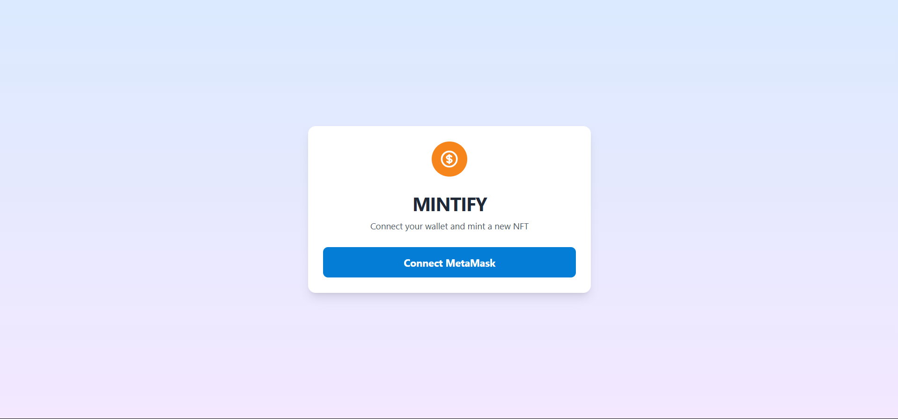
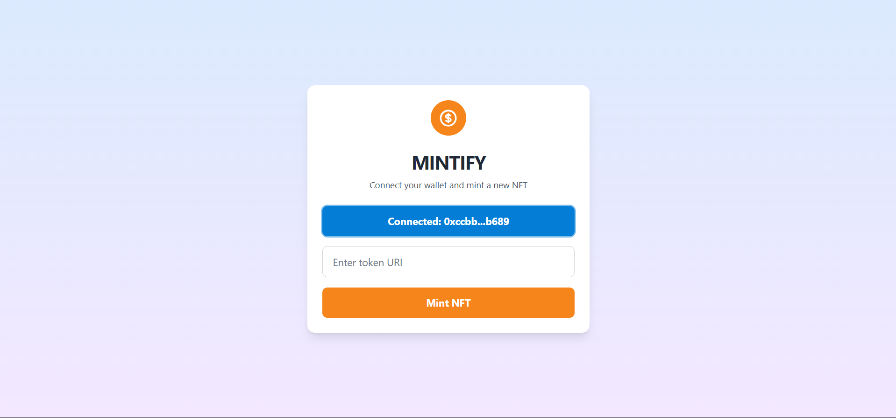
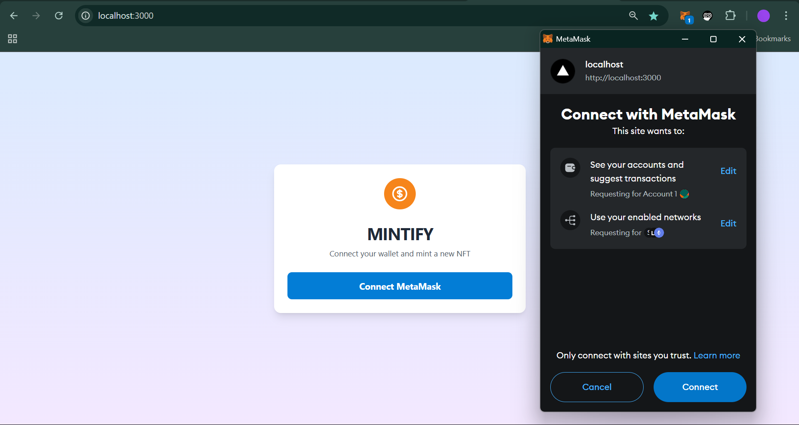
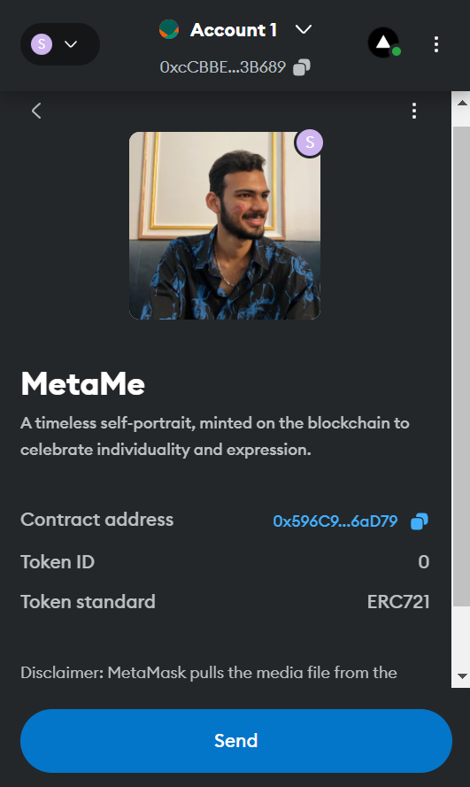
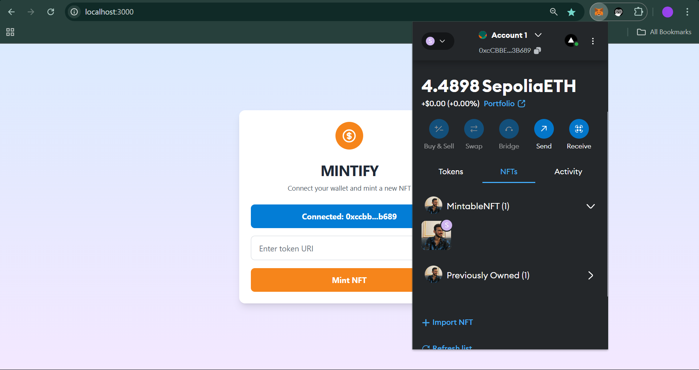

# **Mintify**

Mintify is a decentralized application (DApp) that allows users to mint NFTs (Non-Fungible Tokens) directly from their MetaMask wallet. This project integrates MetaMask for wallet connectivity and uses the Ethereum blockchain to mint unique digital assets with custom metadata (via a token URI).




## **Features**
- **Connect MetaMask Wallet**: Users can easily connect their MetaMask wallet to the DApp.
- **Mint NFTs**: Users can mint their own NFTs by entering a token URI (a link to the digital asset metadata).
- **Ethereum Smart Contract**: The DApp interacts with an Ethereum smart contract to mint NFTs securely.



## **Tech Stack**
- **Frontend**: Nextjs, TypeScript, Javascript
- **Blockchain**: Ethereum, MetaMask, Ethers.js
- **Smart Contract**: Solidity
- **Tools**: Hardhat (for contract deployment), MetaMask (wallet), ethers.js (library for interacting with the blockchain)




## **Installation**

### 1. Clone the repository:
```bash
git clone https://github.com/Aytaditya/NFT-minting
cd mintify
```

### 2. Install dependencies:
```bash
npm install
```

### 3. Set up environment variables:
Create a `.env` file in the root of your project and add your deployed Ethereum smart contract address:

```env
REACT_APP_CONTRACT_ADDRESS=YOUR_DEPLOYED_CONTRACT_ADDRESS
```

Replace `YOUR_DEPLOYED_CONTRACT_ADDRESS` with the actual address of your deployed smart contract.

### 4. Start the development server:
```bash
npm start
```

Navigate to [http://localhost:3000](http://localhost:3000) to access the DApp.

## **How It Works**

1. **Connect MetaMask**: 
   - The user can connect their MetaMask wallet by clicking the "Connect MetaMask" button. This allows the application to interact with their wallet.

2. **Minting NFTs**:
   - After connecting their wallet, users can input a custom `tokenURI` (which is a link to the metadata of the NFT they want to mint).
   - The smart contract's `mintNFT` function is called with the `tokenURI`, minting the NFT for the user.

3. **Blockchain Interaction**:
   - The app uses `ethers.js` to interact with the Ethereum blockchain, sending transactions to the smart contract and waiting for transaction confirmation.

## **Smart Contract**

The smart contract allows users to mint NFTs by calling the `mintNFT` function with a `tokenURI` parameter.

### **Smart Contract ABI**:
```json
[
  {
    "inputs": [{ "internalType": "string", "name": "tokenURI", "type": "string" }],
    "name": "mintNFT",
    "outputs": [{ "internalType": "uint256", "name": "", "type": "uint256" }],
    "stateMutability": "nonpayable",
    "type": "function"
  }
]
```

### **Smart Contract Address**:
Replace `YOUR_DEPLOYED_CONTRACT_ADDRESS` in the environment file with the address of your deployed contract.

## **Deployment**

To deploy this DApp on a live server, follow these steps:

1. Set up a smart contract on Ethereum (or any compatible network like Rinkeby or Polygon).
2. Deploy the front-end using a service like **Vercel** or **Netlify** for serverless hosting.
3. Update the contract address in the `.env` file with the deployed contract address.

## **Troubleshooting**

- **MetaMask Issues**:
  - Ensure that MetaMask is properly installed and configured. If MetaMask is not detected, the DApp will prompt the user to install it.

- **Transaction Failures**:
  - Ensure that the wallet has sufficient gas fees (ETH) for minting the NFT. If the transaction is stuck, try increasing the gas limit.

## **Contributing**

1. Fork the repository.
2. Create a new branch (`git checkout -b feature-branch`).
3. Make your changes and commit (`git commit -am 'Add new feature'`).
4. Push to the branch (`git push origin feature-branch`).
5. Open a pull request.

